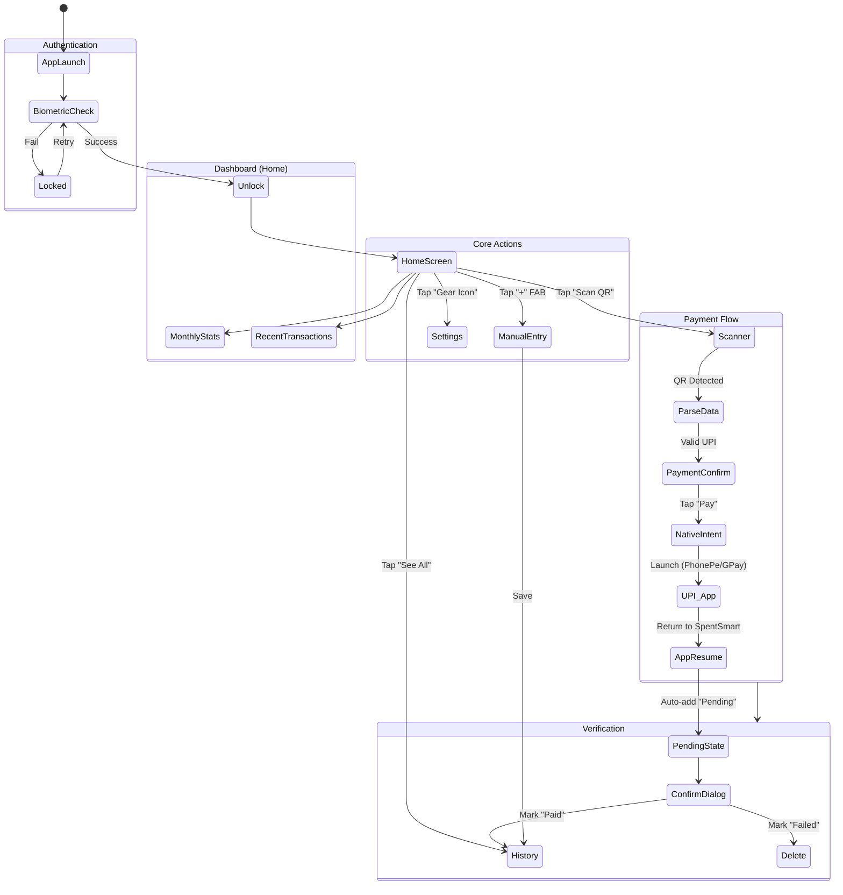
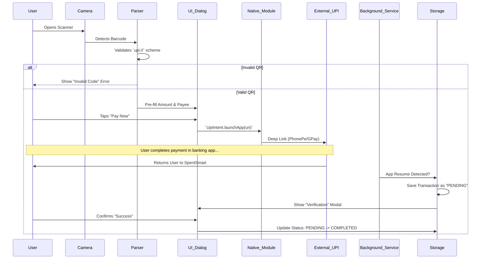
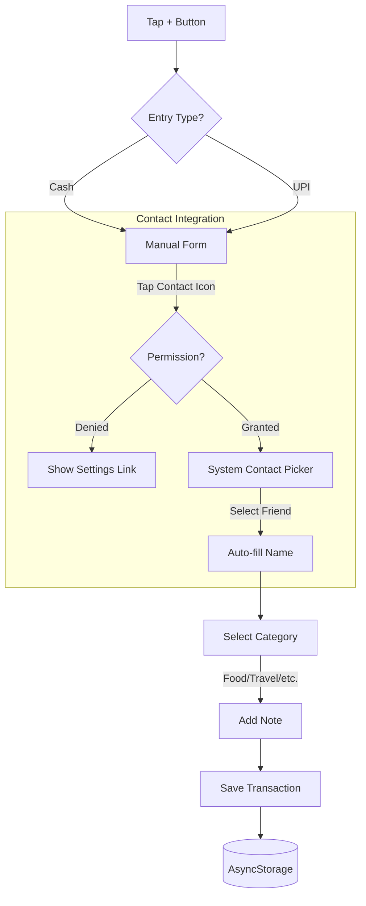
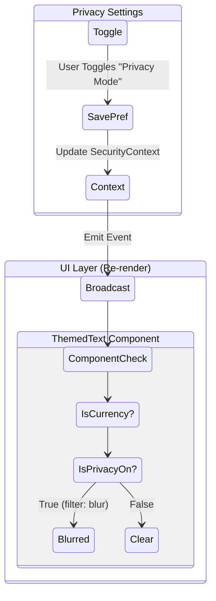
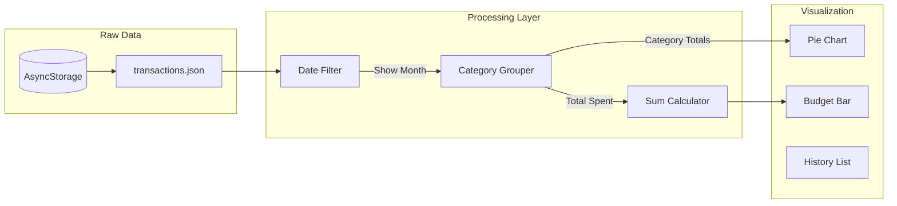
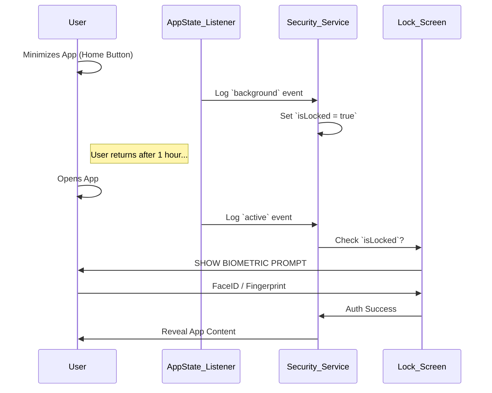

# 🔄 SpentSmart - Complete Application Flow

This document visualizes the complete user journey and system logic for **SpentSmart**. It covers every feature from authentication to payment processing and data management.

## 🗺️ High-Level User Journey

---

## 📸 1. The "Scan & Pay" Lifecycle
**The core feature of SpentSmart.** This flow handles the complex interaction between the Camera, Native Android Intents, and App State management.

---

## 📝 2. Manual Entry & Contact Picking
**For cash transactions or payments not made via QR.** (e.g., sending money to a friend's number).

---

## 🛡️ 3. Security & Privacy Mode
**How SpentSmart protects data visibility.**

---

## 📊 4. Data Flow & Analytics
**How data moves from raw storage to visual insights.**

---

## ⚙️ 5. App State & Locking Logic
**Ensuring the app locks immediately when minimized.**

