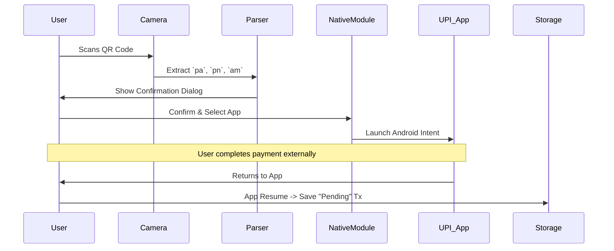

# SpentSmart - Technical Architecture Documentation 🛡️

## 📋 Table of Contents

1. [Project Overview](#project-overview)
2. [Technology Stack](#technology-stack)
3. [Application Architecture](#application-architecture)
4. [Data Models & Types](#data-models--types)
5. [Core Services & Business Logic](#core-services--business-logic)
6. [Native Modules](#native-modules)
7. [Security & Privacy](#security--privacy)
8. [Sequence Diagrams](#sequence-diagrams)
9. [Deployment & Build](#deployment--build)

## 🎯 Project Overview

**SpentSmart** is a privacy-first, offline financial tracker designed for the Indian UPI ecosystem. Unlike traditional trackers that scrape SMS or bank data, SpentSmart uses a "Scan & Verify" model where users scan UPI QR codes, confirming payments via a native intent flow, and verify them later via a "Smart Pending" system.

### Core Philosophy
- **Zero Knowledge**: We don't know who you are. No servers, no accounts.
- **Local First**: All data lives in `AsyncStorage` on the device.
- **Native Performance**: Custom native modules for seamless UPI integration.

## 🛠️ Technology Stack

### Core Framework
- **React Native 0.81.5** (New Architecture Enabled)
- **Expo SDK 54**
- **TypeScript 5.9**

### Key Dependencies
- **Navigation**: `expo-router` (File-based routing)
- **Storage**: `@react-native-async-storage/async-storage`
- **Security**: `expo-local-authentication` (Biometrics), `expo-crypto` (UUIDs)
- **Hardware**: `expo-camera` (QR Scanning), `expo-contacts` (Payee selection)
- **Graphics**: `react-native-svg` (Custom optimized charts)
- **Animation**: `react-native-reanimated`

### Removed Dependencies
- `victory-native` / `react-native-skia` (Removed for bundle size optimization)
- `react-native-chart-kit` (Replaced by custom lightweight SVG components)

## 🏗️ Application Architecture

### High-Level Architecture

```mermaid
graph TD
    User-->|Biometrics| SecurityLayer[Security Context]
    SecurityLayer-->|Authenticated| AppLayer[App Layer]
    
    subgraph "UI Layer"
        HomeScreen
        ScannerScreen
        PaymentModules
        AnalyticsDashboard
    end
    
    subgraph "Service Layer"
        Storage[Storage Service]
        Auth[Biometric Service]
        UPI[Native UPI Intent]
        Stats[Analytics Engine]
    end
    
    subgraph "Data Layer"
        AsyncStore[AsyncStorage JSON]
        SecureStore[SecureStore (Keys)]
    end

    AppLayer-->UI Layer
    UI Layer-->Service Layer
    Service Layer-->Data Layer
```

## 📊 Data Models & Types

### Transaction Entity
```typescript
interface Transaction {
  id: string;              // UUID
  amount: number;          // Stored as float
  type: 'debit' | 'credit';
  category: CategoryKey;   // e.g., 'food', 'travel'
  payeeName: string;       // Verified from UPI / Contact
  payeeVpa?: string;       // Encrypted VPA
  timestamp: number;
  status: 'pending' | 'completed' | 'failed'; // Payment lifecycle
  note?: string;
  isManual: boolean;       // True if manually entered
}
```

### Security State
```typescript
interface SecurityState {
  isLocked: boolean;       // Global app lock state
  privacyMode: boolean;    // Content masking (Blur amounts)
  biometricsEnabled: boolean;
}
```

## 🔧 Core Services & Business Logic

### 1. Security Context (`contexts/security-context.tsx`)
**Role**: The "Gatekeeper" of the app.
- Manages biometric authentication via `expo-local-authentication`.
- Controls `privacyMode`: When active, all currency components blur their content.
- Auto-locks app when put in background (AppState monitoring).

### 2. Native UPI Module (`modules/upi-intent`)
**Role**: Bridge between JS and Android Intents.
This is a **Custom Native Module** written in Kotlin.
- **Function**: `launchApp(packageName, uri)`
- **Behavior**: Directly launches target UPI apps (PhonePe, GPay, Paytm) with a signed payment intent URI.
- **Why Native?**: `Linking.openURL` is flaky for deep Android intents. This module ensures 100% launch success rate.

### 3. Smart Verification (`services/payment-verification.ts`)
**Role**: Heuristic analysis of payments.
- **Pending Logic**: When a user clicks "Pay", the app suspends. On resume, it logs a "Pending" transaction.
- **Confidence Score**: Based on time-away-from-app.
    - < 5s away: High chance of user cancellation (Low Confidence).
    - > 15s away: High chance of completion (High Confidence).

### 4. Custom Charting (`components/home/InsightsGrid.tsx`)
**Role**: High-performance visualization.
- Built using raw `react-native-svg` paths.
- **Optimization**: Calculates SVG paths on the JS thread using `react-native-worklets` functionality (via Reanimated) to prevent UI thread blocking.
- **Features**: Interactive touch handling without heavy libraries.

## 📱 Sequence Diagrams

### 1. The "Scan & Pay" Flow



### 2. Privacy Mode Toggle


## 🔒 Security & Privacy

### Privacy Mode
Built directly into the core `ThemedText` component. If `isPrivacyMode` is true and type is `currency`, the text component applies a masking layer.

### Biometric Lock
Uses `LocalAuthentication.authenticateAsync()`.
- **Fallbacks**: Device PIN/Pattern if biometrics fail.
- **Trigger**: App launch and returning from background (if enabled).

### Android Permissions
- `android.permission.CAMERA`: For QR scanning.
- `android.permission.USE_BIOMETRIC`: For app lock.
- `android.permission.READ_CONTACTS`: For manual entry (Contact Picker).
- **REMOVED**: `READ_SMS`, `ACCESS_FINE_LOCATION` (We strictly do NOT use these).

## 📦 Deployment & Build

### EAS Configuration (`eas.json`)
- **Development**: Debug builds for simulator/device testing.
- **Preview**: Optimized APK (Production logic, local install).
- **Production**: AAB bundles for Play Store submission.

### Environment
- **Project ID**: `spentsmart` (slug matching `app.json`)
- **Package Name**: `com.ujjwaljain.spentsmart`

---

**Author**: Ujjwal Jain
**Last Updated**: Jan 2026
**Version**: 1.0.0 (Production Release)
